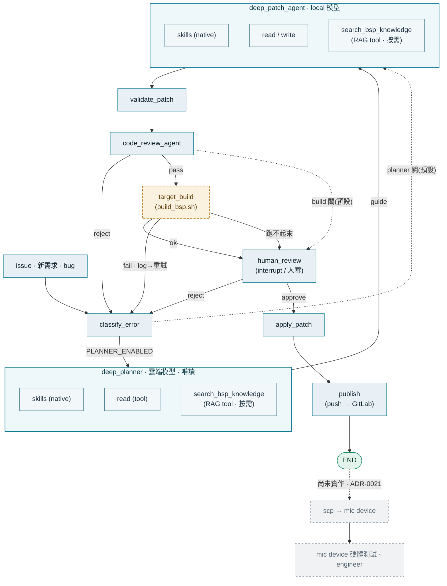

# BSP Repair Agent — Pipeline (現況)

GitLab issue 進來 → 自動定位並修 BSP 原始碼 → 人審 → 推送 → 上板驗證。
下圖是目前實作出來的流程(ADR-0016~0020)。虛線橘框 = flag 控制、預設關;
灰虛線 = 尚未實作。

## 圖例

| 樣式 | 意義 |
|---|---|
| 藍框(實線) | 確定節點 |
| 橘框(虛線) | flag 控制,**預設關** |
| 綠框 | 終點 / 成功 |
| 灰框(虛線) | 尚未實作 |

## 各階段一句話

| 節點 | 做什麼 | Flag(預設) |
|---|---|---|
| `deep_planner` | 雲端強模型(唯讀)看懂問題、決定改法,產出一份 guide。skill / read / **RAG 都是它自己呼叫的工具**(`search_bsp_knowledge`),沒有上游預載 | `PLANNER_ENABLED` · 關 |
| `deep_patch_agent` | local 模型照 guide 實際改 code,並可自行反覆呼叫 skill / read/write / `search_bsp_knowledge`,在 staging worktree 上動手 | `DEEP_AGENT_ENABLED` · 開 |
| `code_review_agent` | 獨立 LLM 審 diff。不過 → 回 issue 重試;過 → 進 build gate | `CODE_REVIEW_ENABLED` · 開 |
| `target_build` | staging 套 diff → 跑 `build_bsp.sh`。編失敗把 log 回餵給 agent 重試;跑不起來 → 人審 | `TARGET_BUILD_ENABLED` · 關 |
| `human_review` | 人只看得到「已通過 review(且 build 過)」的 patch。approve → 套用;reject → 回 issue | interrupt / resume |
| `apply → publish` | 批准後把 diff 套到真 working tree,commit / push 回 GitLab | `AUTO_PUSH_ENABLED` 控制推送 |

## 備註

- **三條 error 迴圈**都回到 `classify_error` 開新一輪(受 `max_loops` 限制,撞頂就轉人審):
  code review 打回、build 編失敗(帶 log 當教材)、人審 reject。
- **Legacy 路徑**(`DEEP_AGENT_ENABLED=false`):`select_skills → load_skill → inspect_repo → patch_agent`,仍保留可回退,圖上未畫。
- 相關 ADR:0016 deep patch · 0017 skill tools · 0018 build env · 0019 target build · 0020 planner/executor。
